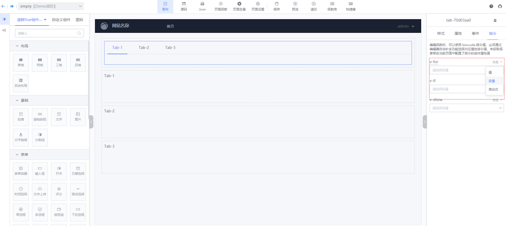
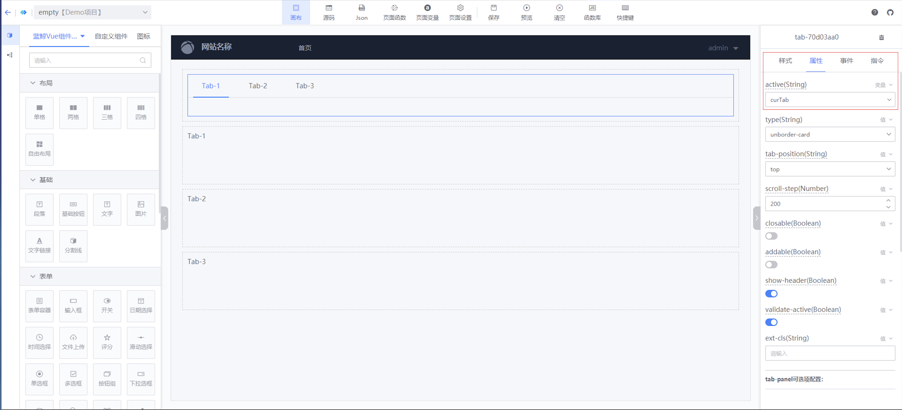
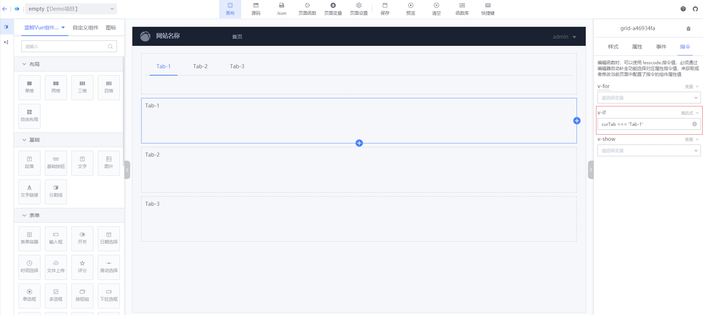
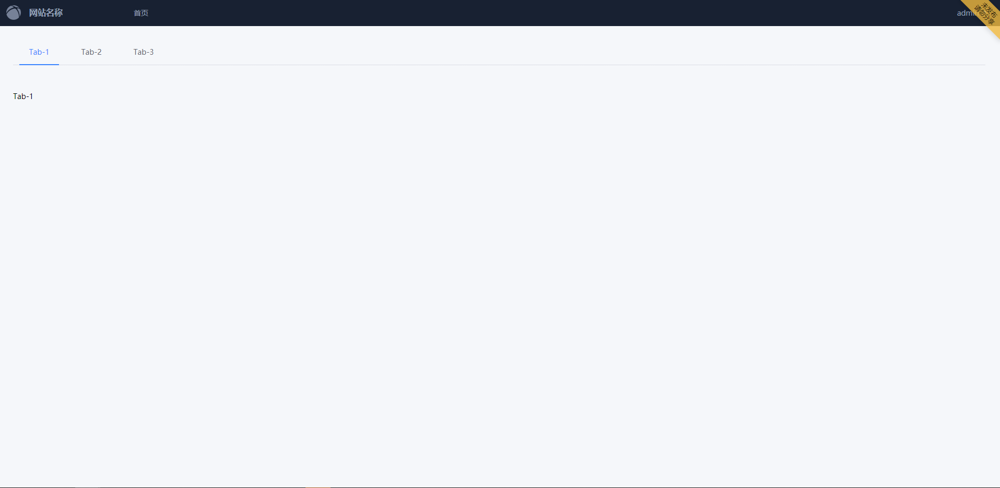
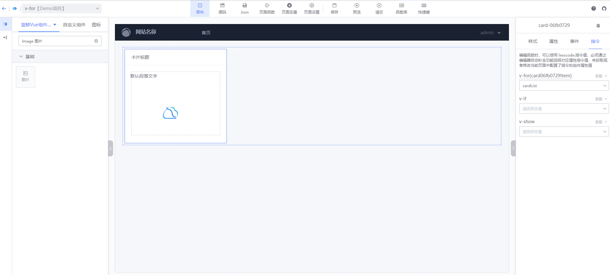
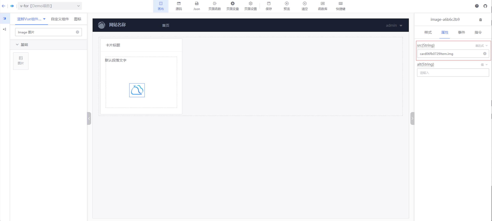
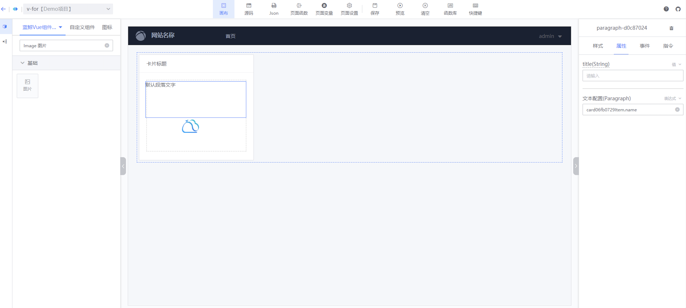
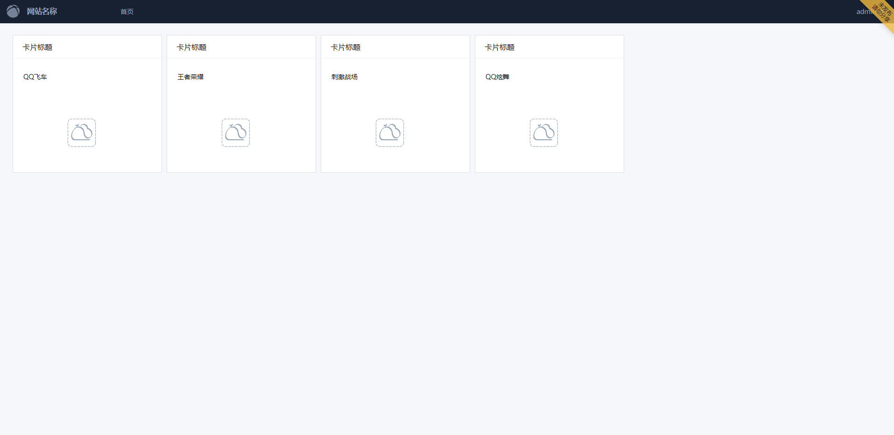

## Directive Usage Guide

---

In the Blue Whale Operations Development Platform (LessCode), you can utilize [Vue directives](https://cn.vuejs.org/v2/api/#%E6%8C%87%E4%BB%A4) to enable more complex application functionalities. Directives allow you to achieve the following:

- By configuring property-related directives, you can dynamically modify the values of components and access these values in functions for further application development.
- By configuring directives in the directive panel, you can render multiple elements, control element visibility, and create two-way data bindings on form controls or components.

### Configuring Property-Related Directives

---

#### Configuration Steps:

:::info

- Open the canvas editing page.
- In the canvas editing area, use the mouse to select a component.
- In the right-side configuration area, switch to the "Properties" tab.
- Find the property you want to configure, click the top-right corner of the property to switch it to a variable or expression.
- Choose a variable or enter an expression.
  :::

#### Usage Instructions:

- When a property is switched to a variable and a variable is selected, the property's value will be bound to that variable. You can modify or access the property's value in a function. Note: Use `lesscode.` in functions to trigger variable selection, allowing you to select a variable bound to a property.
- When a property is switched to a directive and an expression is entered, the property's value will be computed based on the expression. You can enter expressions like `lesscodeVar.inputValue` or `'prefix' + inputSearchVar`. Note: The expression can use page variables and global properties provided by JS; other variables will be treated as `undefined`.

### Configuring Directive Panel Directives

---

#### Supported Directives:

Currently, `v-if`, `v-show`, `v-for`, `v-model`, and `v-html` are supported.

#### Configuration Steps:

:::info

- Open the canvas editing page.
- In the canvas editing area, use the mouse to select a component.
- In the right-side configuration area, switch to the "Directives" tab.
- Find the directive you want to configure, click the top-right corner to switch it to a value, variable, or expression.
- Choose a variable or enter an expression.
  :::

#### v-if, v-show Usage Instructions:

> Both `v-if` and `v-show` control the visibility of elements. The difference is `v-if` controls element rendering, while `v-show` controls the `display` property. Here's how to use `v-if`:
>
> :::info

- Drag a `Tab` and three `Grid` components onto the canvas.
- Select the `Tab` component, switch to the "Properties" tab, and bind the `active` property to a variable `curTab`. (See Image 1 below)
- To distinguish the three `Grid` components, drag a `Paragraph` component into each and add distinguishing text.
- Select a `Grid` component, switch to the "Directives" tab, set `v-if` to an expression, and enter `curTab === 'Tab-1'`. Configure the other two `Grid` components similarly. (See Image 2 below) Note: `Tab-1` is one of the values configured in the `Tab` component.
- This completes the requirement to display different grids when switching tabs. (See Image 3 below)
  :::

#### v-for Usage Instructions:

> The `v-for` directive can render a set of data into a set of elements. Here's how to use `v-for`:
>
> :::info

- Drag a `Card` component onto the canvas, and drag a `Paragraph` and `Image` component inside it.
- Select the `Card` component, switch to the "Directives" tab, and bind the `v-for` directive to a variable `cardList`. (See Image 1 below) Note: The application should have a variable `cardList`, which is an array of 4 elements with `img` and `name` properties.
- The `card06fb0729Item` displayed above the `v-for` directive can assign values to the directives of the current component and its children, except for the current component's `v-if` and `v-show`.
- Select the `Image` component, set the `src` property to the expression `card06fb0729Item.img`. (See Image 2 below) Note: The `card06fb0729Item` of `cardList` should have an `img` property.
- Select the `Paragraph` component, set the `text content` property to the expression `card06fb0729Item.name`. (See Image 3 below) Note: The `card06fb0729Item` of `cardList` should have a `name` property.
- This completes rendering a set of data into a set of elements. (See Image 4 below)
  :::

#### v-model, v-html Usage Instructions:

> Not all components support `v-model` and `v-html`; here are specific instructions
>
> :::info

- `v-model`: Creates two-way data bindings on form controls or components. Currently supported on form control type components. You can use the `v-model` directive to create two-way data bindings on form elements. It automatically selects the correct method to update the element based on the control type. For more details, see the [Form Input Bindings documentation](https://cn.vuejs.org/v2/guide/forms.html).
- `v-html`: Used to update the innerHTML of an element, currently supported on the `Paragraph` component.
  :::
