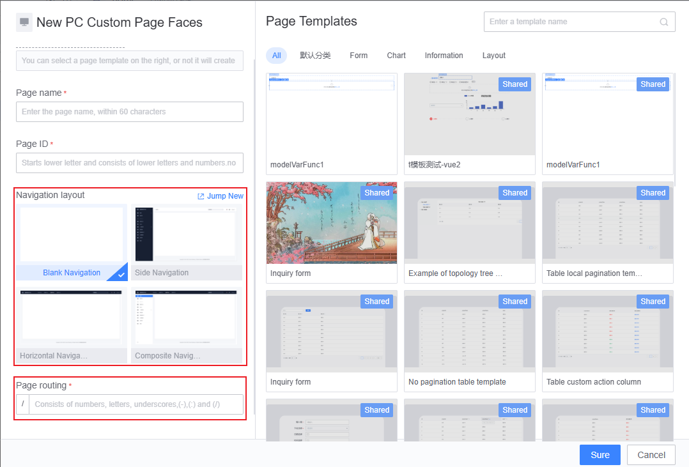
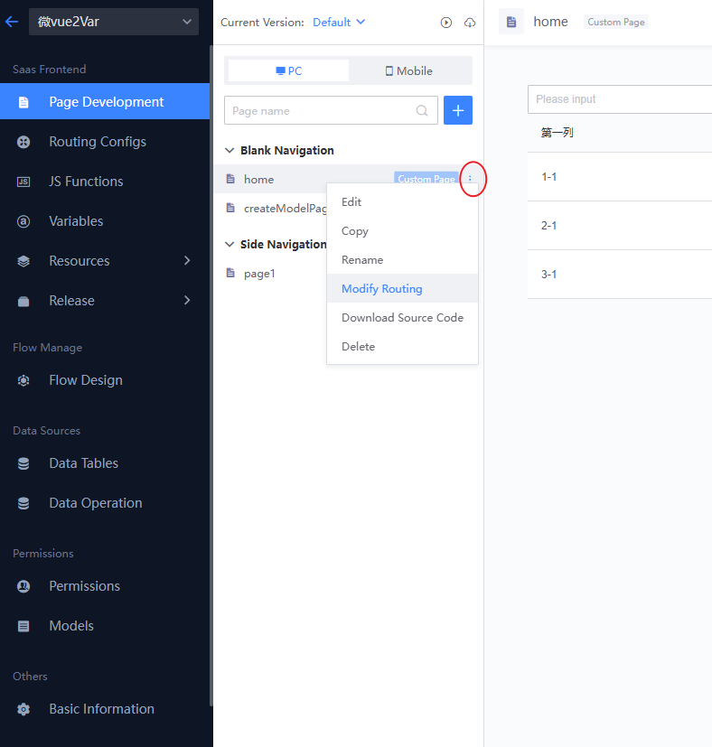
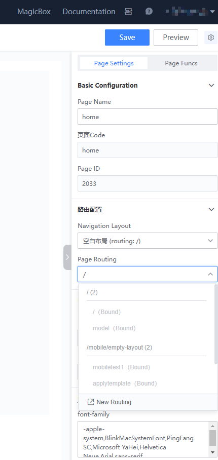
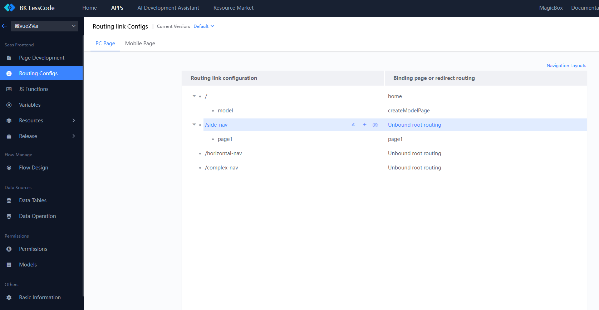
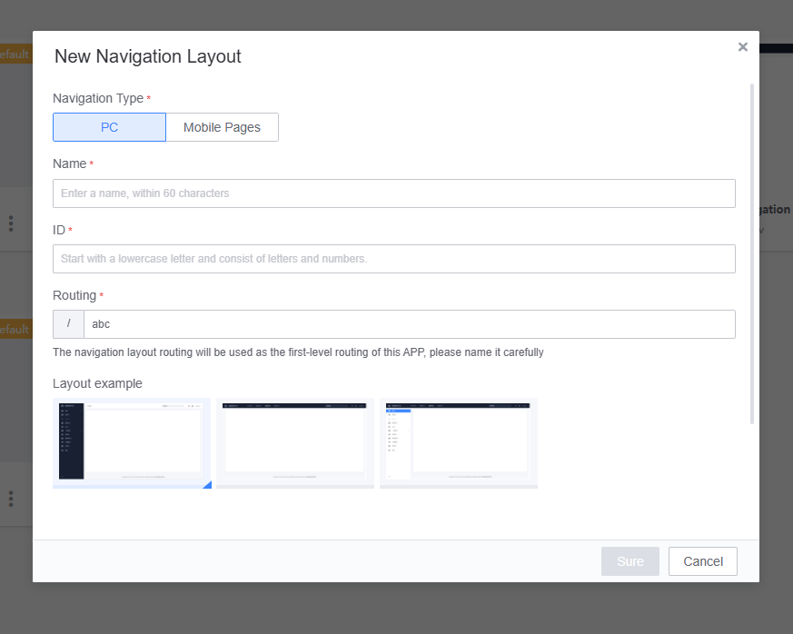
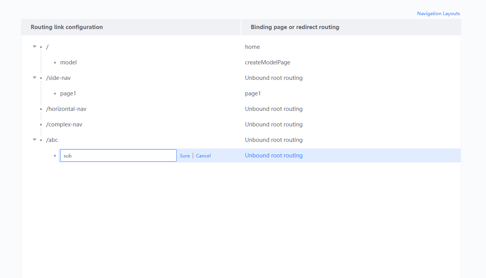
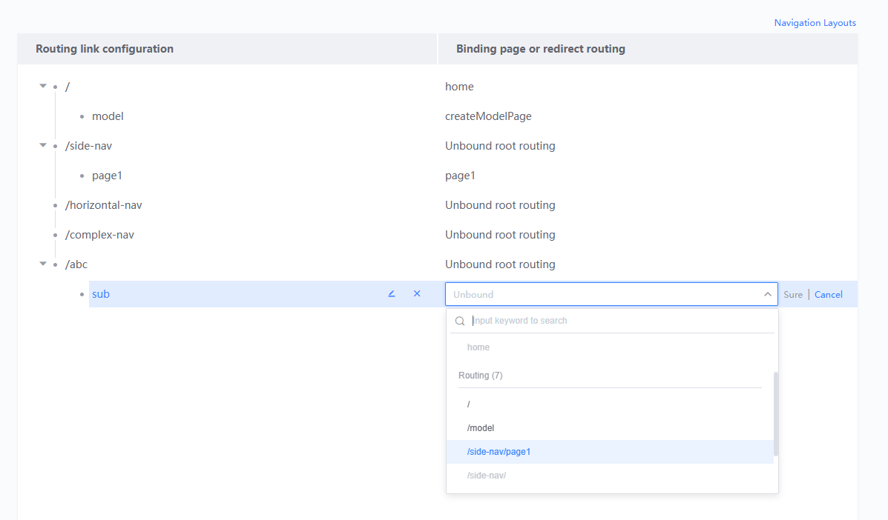
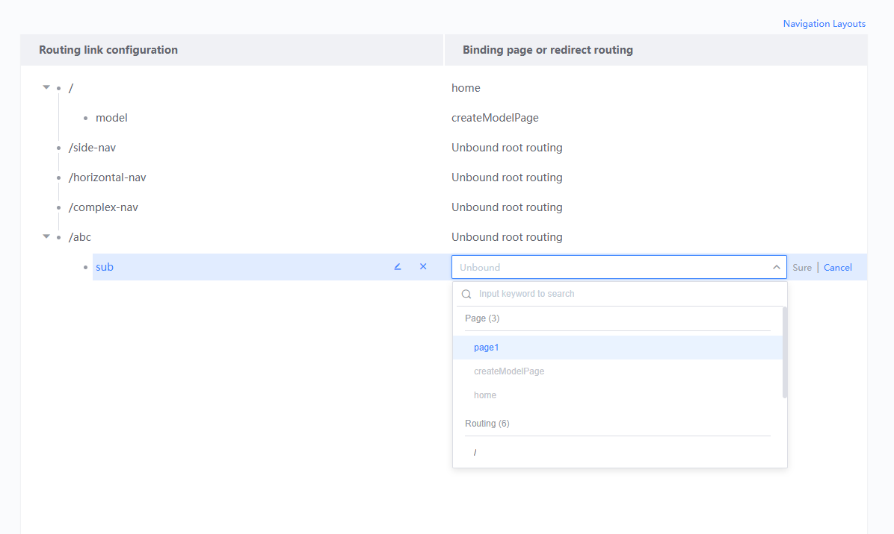

# Guide to Using Route Management

When a new page is created, a route for the page is typically created simultaneously. You can also maintain the entire app's routes through the "Route Management" feature. Routes are designed with two levels: the first level is the "Navigation Layout" route, and the second level is the page route.

## Pages and Routes

1. When creating a new page, you need to fill in the page's route. You can see that the final route of the page consists of the navigation layout (route) + page route.

> If you want to create or modify a navigation layout, you can access the "Navigation Layout Management."

2. To modify a page's route, since pages and routes are mutually bound, you need to choose an unused route when modifying. Below are the common entry points for modifying page routes.

 
(1) "Page Development" left-side layout and page list 

 
(2) Edit Page - Right-side "Page Configuration" panel

## Managing Application Routes

In the "**Route Management**" feature, you can manage the entire application's routes. The left side of the page lists route links, and the corresponding right side allows binding pages or redirecting routes. Application routes are a two-level tree structure, with the first level being the "Navigation Layout" route and the second level being the page route.

To add a first-level route, which is the navigation layout route, you need to add a first-level route by creating a new navigation layout.

To add a second-level route, you can continue to add routes under a first-level route and bind a page or redirect route to the route after adding it.

To unbind a route, deleting a route will unbind the route. If a route of a page is deleted, you can rebind a route to that page.

 
(Page A's route pagea is deleted, then rebound with another route)
