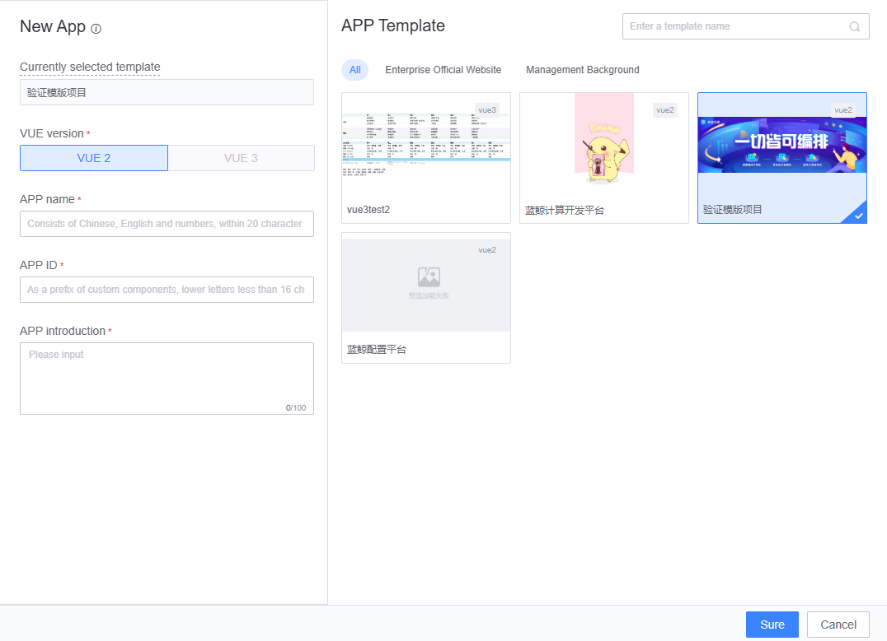

## Application Template Usage Guide

The Blue Whale Operations and Maintenance Development Platform (LessCode) offers application-level templates such as official website templates, backend management templates, and announcement templates. These templates include complete application functionalities like functions, variables, and databases. You can directly create a new application based on these templates without assembling from scratch, and simply modify the corresponding content to quickly complete the application development.

## How to Use Application Templates

There are two ways to use application templates:

### Create a New Application Through the Application Template Market

Go to Resource Market -> Template Market, select an appropriate application template, then click "Create as New Application". Alternatively, you can download the application template source code and perform secondary development locally.

### Choose to Create from a Template When Creating a New Application

1.Choose to create from a template when creating an application.

{width="80%"}

2.Once the application is successfully created, you will see all the pages included in the application template and modify the page content as needed.
