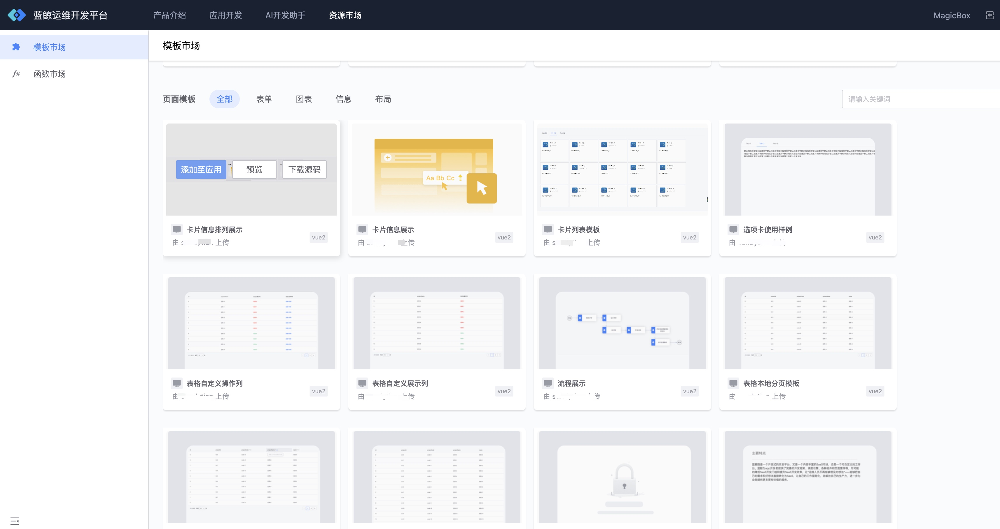
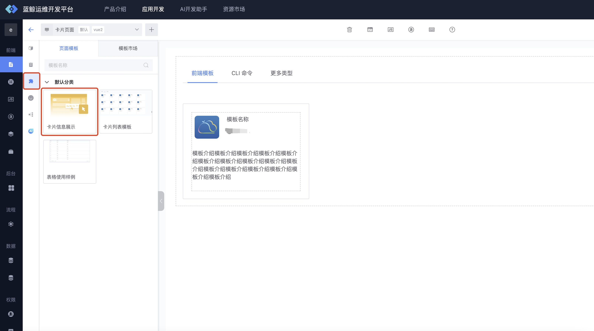
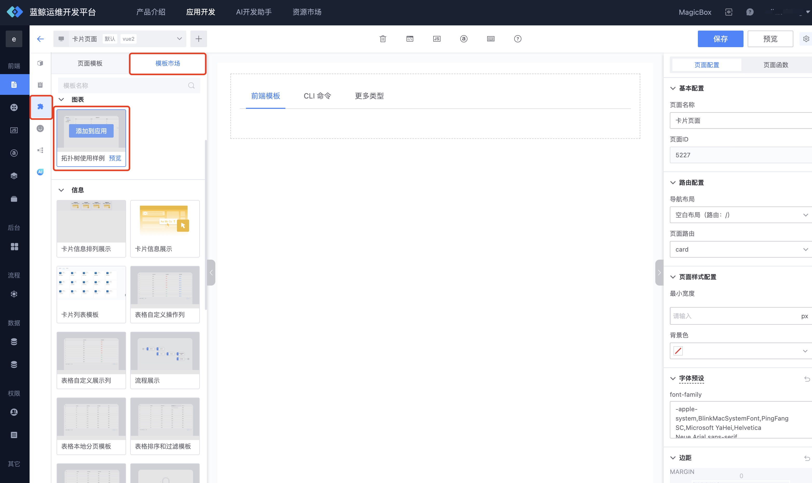
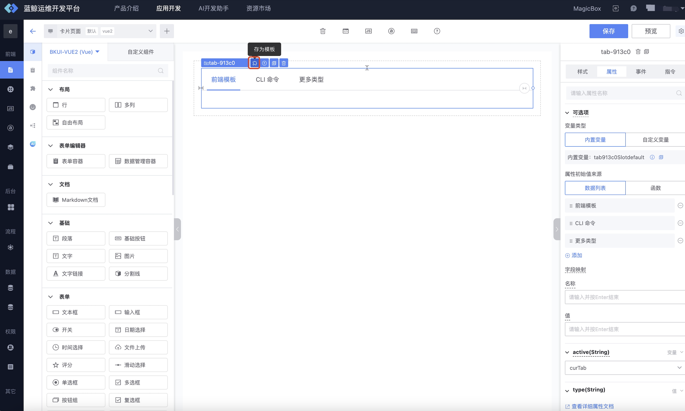
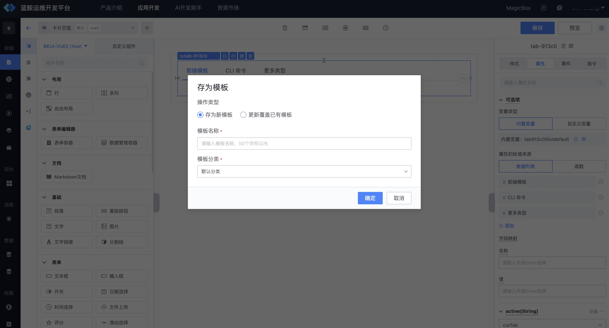
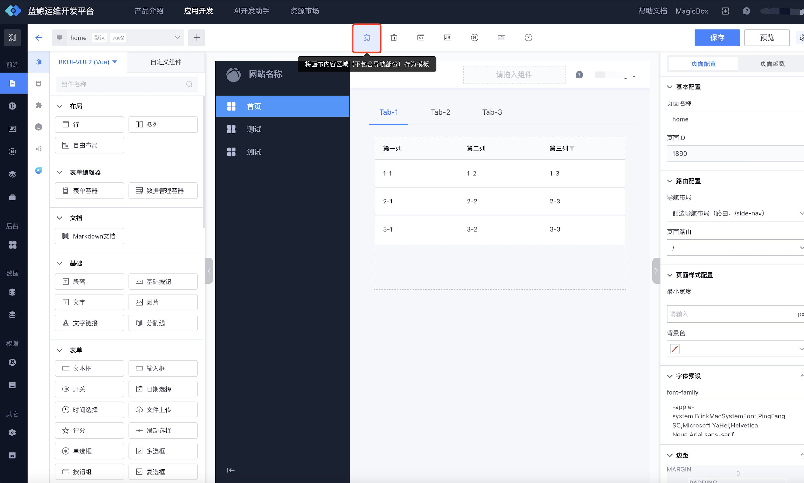
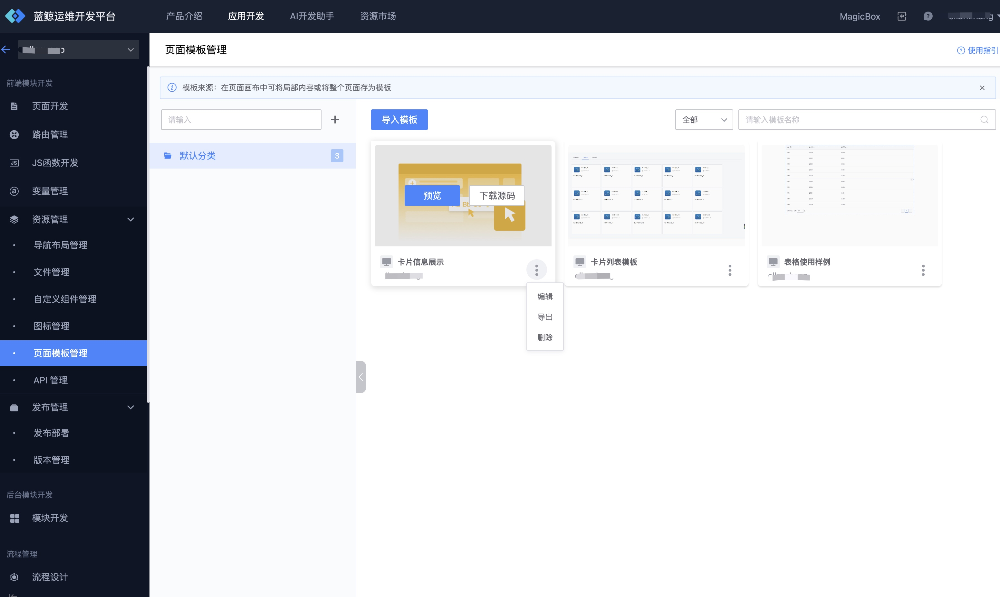
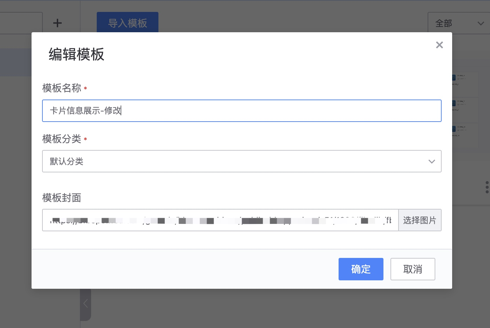
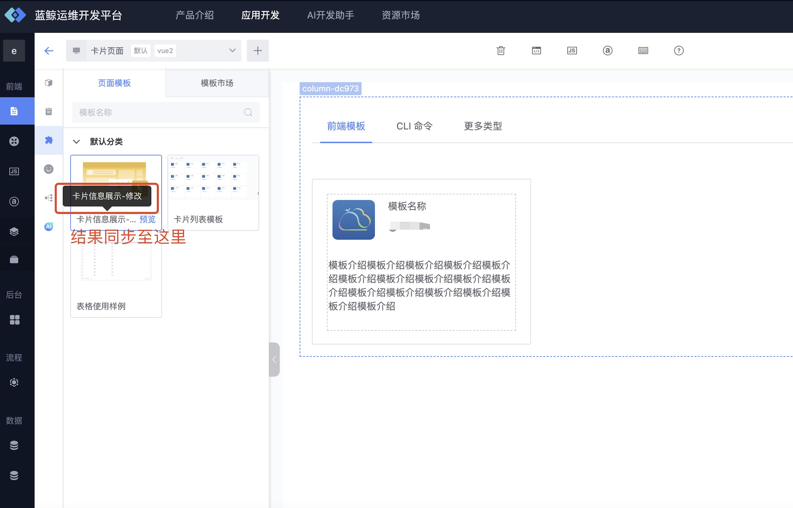

# 页面模板的使用指引

蓝鲸运维开发平台提供了两种不同粒度的模板，项目级模板和页面模板，页面模板是较项目级是更低粒度的模板，可以灵活的应用在各个页面当中。

## 第一种：通过模板市场添加至项目当中

1. 进入“**模板市场**”，选择合适的模板，然后“**添加至应用**”

2. 在添加完成后，就可以在画布模板库里使用了

## 第二种：通过画布的模板市场添加

在画布的模板市场也可以快捷的添加页面模板，有黑色遮照部分代表未添加至应用的页面模板，点击“**添加到应用**”，即可在项目中快捷使用。

## 存储模板

 在页面的排版过程中，也可以将页面内容存为页面模板，实现局部内容的快速复用。
 
 1. 选中对应的模块，点击“**存为模板**”

 
 
2. 填写要存入的模板分类

  
 

3. 还可以在画布中直接将某个页面的内容存为页面模板（不包含导航内容），可以嵌入进任何形式排版的页面
 
   

## 如何管理模板？

对于从市场中添加的模板和自定义的模板，我们提供了专门的模板管理功能，用户可以自定义分类管理，以及对模板进行编辑、删除，导出等管理。

1. 进入“**页面模板管理**”，可以导入导出模板（支持json 格式）、修改分类名称、模板的属性等等

   

   

2. 修改后的效果会同步至画布中的模板

   

