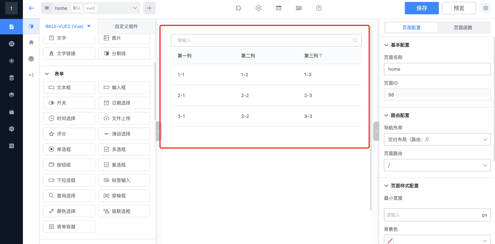
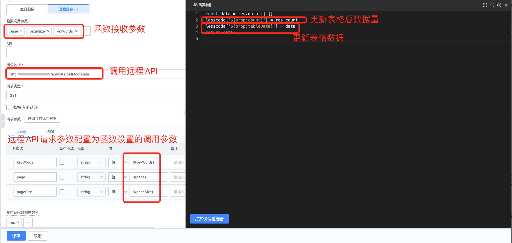
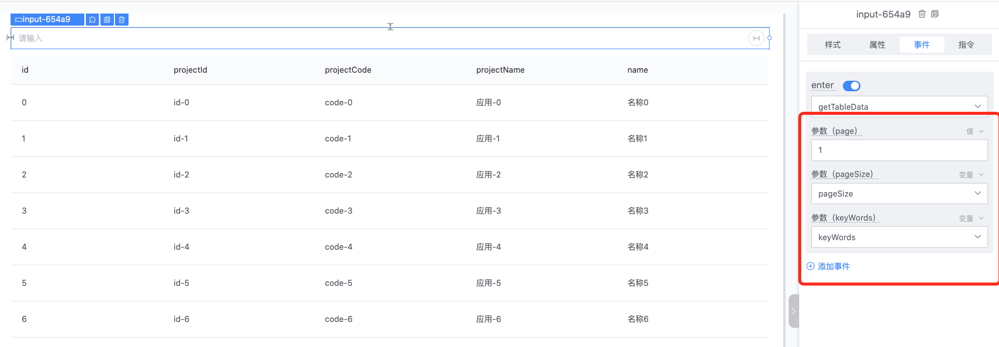
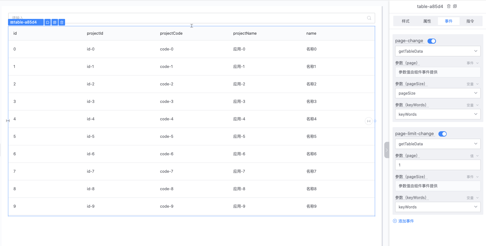
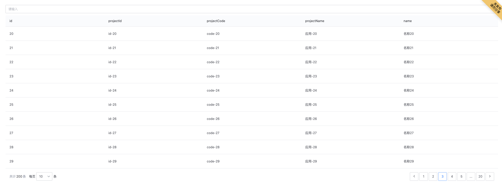

## 如何开发一个表格查询页面
### 第一步：拖拽“查询选择”、“表格”组件到画布



### 第二步：配置组件属性和指令

- 设置表格数据来源：新建变量“tableData”，配置“表格”组件属性“data”，绑定变量“tableData”

- 获取查询输入关键字：新建变量“keyWords”，配置“查询选择”组件属性指令"v-model"绑定变量“keyWords”
- 设置表格分页：新建变量“
pagination”，变量默认值为：
```js
{
    "current": 1,
    "count": 3,
    "limit": 10,
    "limitList": [
        10,
        20,
        50,
        100
    ],
    "showLimit": false
}
```
- 配置“表格”组件属性“
pagination”绑定变量“
pagination”


### 第三步：“表格”组件 “data” 属性及事件配置

1、 配置表格“data”属性数据初始值来源为函数，并绑定函数 “getTableData”



2、 根据“data”属性数据返回字段刷新和调整表头配置


**注意：**

编辑函数时

1、可以使用 lesscode.指令值，必须通过编辑器自动补全功能选择对应属性指令值，来获取或者修改当前页面中配置了指令的组件属性值。

2、可以使用 lesscode.函数名，必须通过编辑器自动补全功能选择需要调用的函数。


### 第四步：查询 “按钮”组件事件配置

1、查询函数


2、查询按钮绑定事件



### 第五步：表格分页事件配置




### 第六步：预览效果


