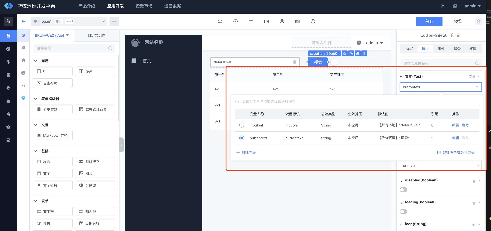
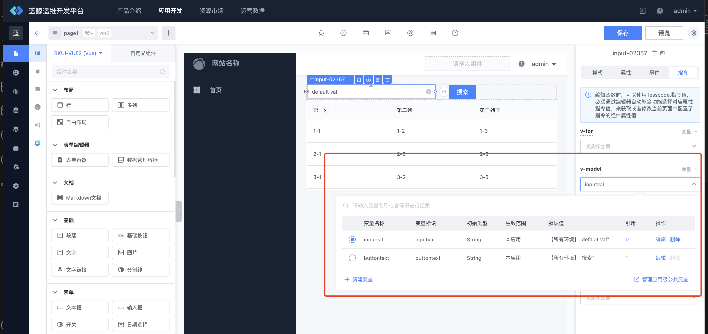
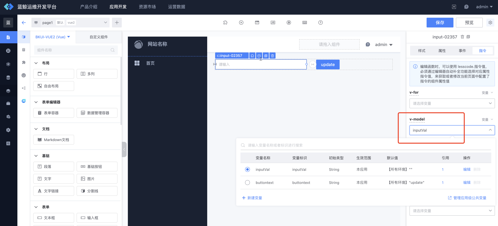
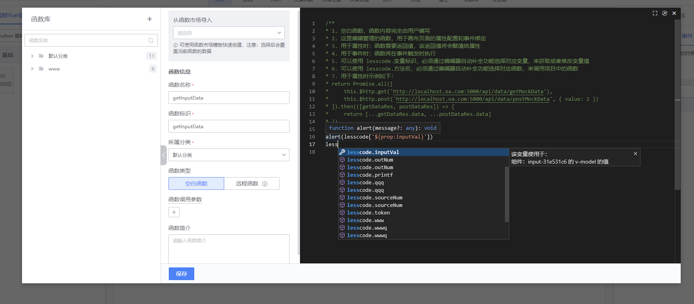
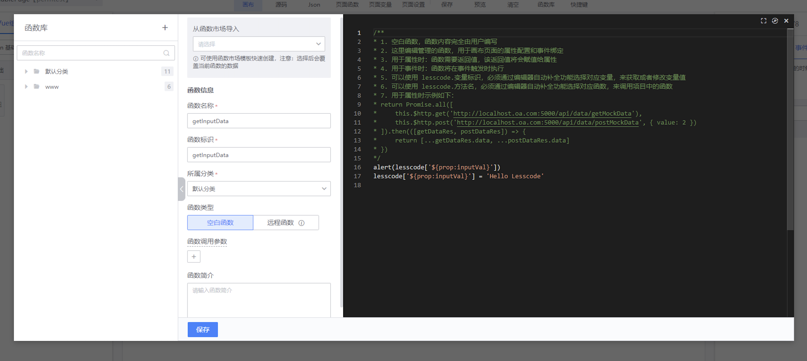
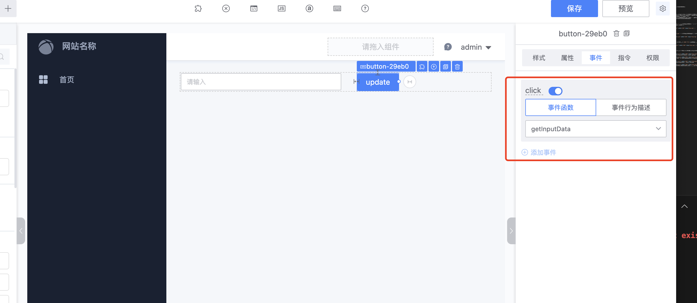

## 变量使用指引
---
蓝鲸可视化开发平台中：可以由用户创建应用变量，并在页面开发中使用变量。通过使用变量，可以完成以下需求：
* 给组件属性动态赋值：将变量与属性绑定，后续可以通过函数操作变量来获取或者修改变量的值，来影响组件的属性
* 给组件指令动态赋值：目前平台提供了 VUE 语法中的指令，将变量与指令绑定，可以通过函数操作变量来控制指令的表现，具体指令的表现可以参考[VUE指令文档](https://cn.vuejs.org/v2/api/#%E6%8C%87%E4%BB%A4)
* 应用全局变量：可以在应用定义全局变量，所有页面可以共享使用这个变量的值
* 变量分环境赋初始值：一个变量可以分别配置在预览环境、预发布环境和生产环境的初始值
* 函数参数使用变量：远程函数的【请求地址】和【请求参数】可以使用变量来组装和动态获取值

### 应用全局变量管理
---
#### 应用全局变量管理页面路径：
应用开发（选择应用） -> 资源管理 -> 变量管理
#### 应用全局变量使用说明：
* 可以在应用变量管理页面对全局变量进行增删改查操作
* 已经使用的变量可查询引用位置，不允许删除
* 全局变量的变量标识在应用内全局唯一
* 修改全局变量的默认值，所有页面中引用该变量的组件属性或指令的默认值将会被修改

### 应用页面变量管理
---
#### 应用页面变量管理页面路径：
应用页面画布 -> 页面变量
#### 应用页面变量使用说明
* 应用页面变量展示了本页面可用的变量详情（包含了全局变量和本页的页面变量）
* 只能操作页面变量，全局变量需要到全局变量管理页进行操作
* 已经使用的变量不允许删除
* 可以对本页面的页面变量进行增删改查操作

### 变量初始类型介绍
---
蓝鲸可视化开发平台目前提供了七种变量初始化类型，以便应用开发使用，该类型只做为初始化的类型，可以在函数中对变量进行修改。
* 普通数据类型（String，Number，Boolean，Array，Object）：即 JS 数据类型，在绑定给属性的时候，会基于数据类型进行过滤
* 图片地址：用户可以上传一张图，然后该图片可以在画布中绑定到可以使用图片的属性上
* 计算变量：可以根据多个变量或者函数进行组合，最后返回一个值，该变量可以应用到所有的属性和指令上。计算变量具体用法可以参考[VUE计算属性文档](https://cn.vuejs.org/v2/guide/computed.html#%E8%AE%A1%E7%AE%97%E5%B1%9E%E6%80%A7)

### 变量与属性绑定
---
:::info
在应用页面画布中，选择相应的组件，在组件的配置面板 -> 选择`属性` -> 选择要绑定变量的属性 -> 属性值类型切换为变量，即可选择变量。也可以切换成值或表达式，表达式可以直接写变量标识来使用变量，编写最终是JS的表达式
:::

### 变量与指令绑定
---
:::info
在应用页面画布中，选择相应的组件，在组件的配置面板 -> 选择`指令` -> 选择要绑定变量的指令 -> 选择变量即可
:::

### 变量与函数绑定
---
:::info
远程函数的【请求地址】 和 【请求参数】可以使用变量：如图所示，可以使用`{变量标识}`在请求地址中使用变量
:::

 

### 函数中操作变量
---
:::info
在函数中，可以使用 `lesscode.变量标识` 关键字唤起快捷输入，必须通过编辑器自动补全功能选择对应变量，来获取或者修改变量值，下面举例说明：
:::

 
#### 如上图所示：页面中添加一个输入框组件和一个基础按钮组件，并给输入框组件的`v-model`指令绑定一个变量

 
#### 如上图所示：新增一个函数，函数里面可以通过 `lesscode.变量标识`关键字唤起快捷输入，根据提示可以找到想修改的变量，选择对应的变量后，就可以对变量进行操作了

 
#### 如上图所示：函数编写的时候，我们先弹出输入框的值，然后修改输入框的值为`Hello Lesscode`

 
#### 如上图所示：最后在基础按钮组件的`click`事件中，绑定刚刚写的函数。然后可以在预览中进行查看效果了
